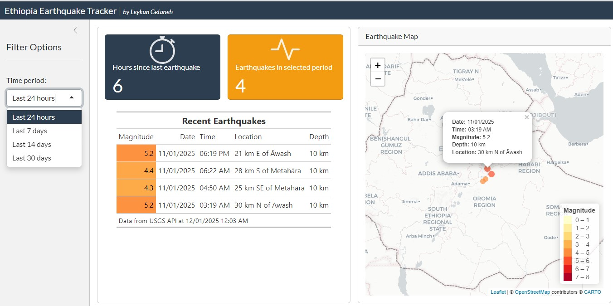

# The Ethiopia Earthquake Tracker!Add commentMore actions
A real-time web application that monitors seismic activities across Ethiopia, built with R Shiny. Recently, Ethiopia has experienced a series of earthquakes of varying magnitudes, making this tool more crucial than ever.

**Key Features:**

✨ Live tracking of earthquakes using USGS (United States Geological Survey) data  
✨ Interactive map visualization  
✨ Real-time statistics and updates  
✨ Time-based filtering options  
✨ Automatic 5-minute data refresh  

The app serves as a valuable tool for monitoring seismic activity in Ethiopia, providing both researchers and the general public with easy access to earthquake data through an intuitive and user-friendly interface.

🔗 [Check out the application here!](https://0194598d-2226-dd34-14a9-412189b7b1dc.share.connect.posit.cloud/)  
📸 